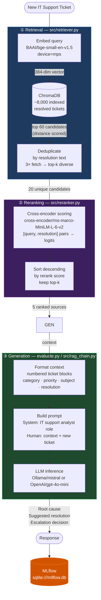
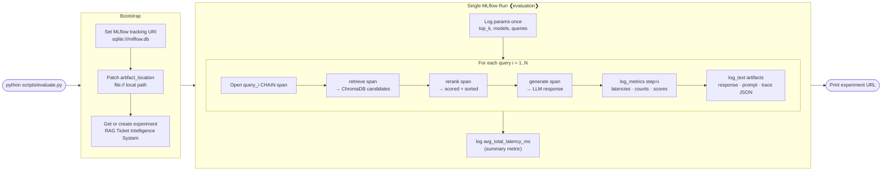
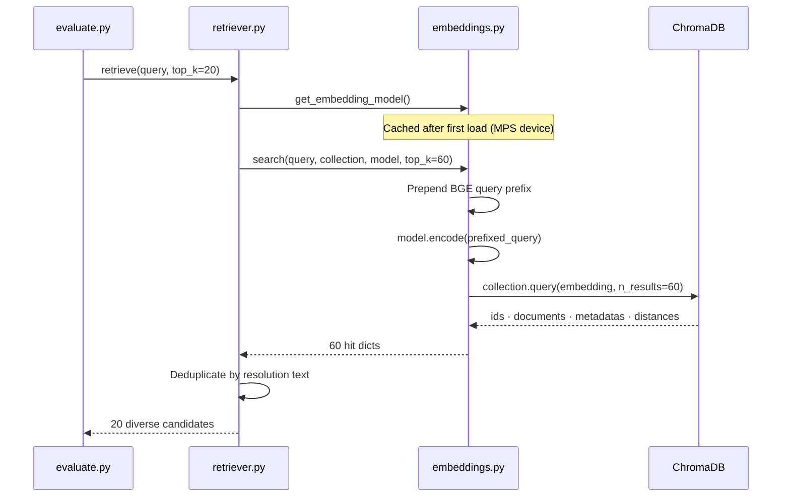
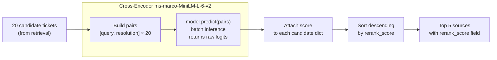
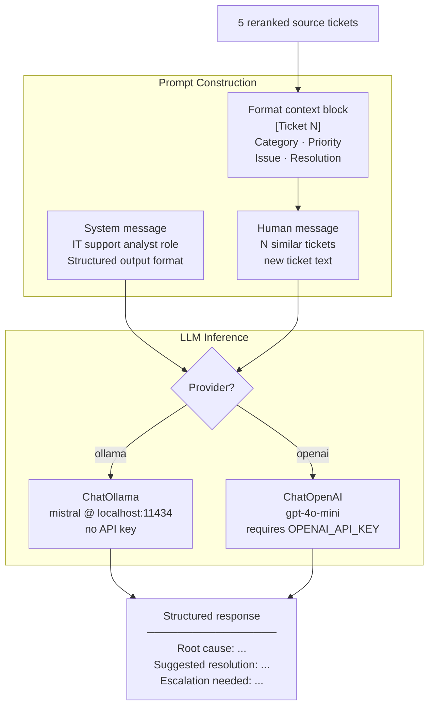

# Evaluation Pipeline — Technical Reference

This document explains the design, data flow, and MLflow integration of the evaluation harness (`scripts/evaluate.py`) for the RAG Ticket Intelligence system.

---

## Table of Contents

1. [System Overview](#1-system-overview)
2. [Full Pipeline Architecture](#2-full-pipeline-architecture)
3. [Evaluation Harness Design](#3-evaluation-harness-design)
4. [Stage Deep-Dives](#4-stage-deep-dives)
   - [Retrieval](#41-retrieval)
   - [Reranking](#42-reranking)
   - [Generation](#43-generation)
5. [MLflow Integration](#5-mlflow-integration)
   - [Experiment & Run Layout](#51-experiment--run-layout)
   - [Span Hierarchy](#52-span-hierarchy)
   - [Metrics Reference](#53-metrics-reference)
   - [Artifacts Layout](#54-artifacts-layout)
6. [Structured Logging](#6-structured-logging)
7. [Configuration Reference](#7-configuration-reference)
8. [How to Interpret Results](#8-how-to-interpret-results)

---

## 1. System Overview

The RAG Ticket Intelligence system ingests a resolved IT support ticket history, encodes it into a vector database, and — given a new ticket — retrieves the most relevant past tickets and uses an LLM to generate a resolution suggestion grounded in that history.

The evaluation harness runs a fixed set of test queries through the full pipeline end-to-end, measures latency at each stage, and logs everything to MLflow so runs can be compared, charted, and audited.

```
┌─────────────────────────────────────────────────────────┐
│                RAG Ticket Intelligence                  │
│                                                         │
│   Knowledge Base          Evaluation Harness            │
│   ┌────────────┐          ┌──────────────────────┐      │
│   │ 10,000     │  query   │ scripts/evaluate.py  │      │
│   │ resolved   │◄─────────│                      │      │
│   │ tickets    │          │  10 test queries     │      │
│   │ (ChromaDB) │          │  3-stage pipeline    │      │
│   └────────────┘          │  MLflow logging      │      │
│                           └──────────────────────┘      │
└─────────────────────────────────────────────────────────┘
```

---

## 2. Full Pipeline Architecture

Each query passes through three sequential stages. The diagram below shows the full data flow from raw query text to a generated resolution, including the models and data stores involved at each step.



---

## 3. Evaluation Harness Design

### Why a harness?

A harness is a script that drives your system repeatedly under controlled conditions and measures it. It answers: *"How does the pipeline behave across different inputs, models, and configurations?"* Unlike unit tests (which check correctness), the harness checks **performance and quality** — latency, retrieval diversity, rerank score distributions, and response coherence.

### Execution flow



### Key design decisions

| Decision | Rationale |
|---|---|
| Single run for all queries | Groups related data; metrics with `step=i` become time-series charts for cross-query comparison |
| Spans nested inside one run | The Traces tab shows one trace tree per run — retrieve/rerank/generate are visible as child spans |
| `file://` artifact root | SQLite backend without a running server can't resolve `mlflow-artifacts://` URIs — patched directly in the DB |
| `top_k_retrieve = 3 × top_k_rerank` | Deduplication by resolution text often removes 30–50% of candidates; over-fetching ensures enough diverse results survive |
| Rerank on `resolution`, not `description` | We want resolutions that are *actionable for the query*, not descriptions that are merely similar |

---

## 4. Stage Deep-Dives

### 4.1 Retrieval

**File:** `src/retriever.py`, `src/embeddings.py`



**BGE query prefix** — the `BAAI/bge-small-en-v1.5` model was trained with the prefix `"Represent this sentence for searching relevant passages: "` prepended to query strings (not documents). Omitting it measurably degrades retrieval quality.

**Deduplication logic** — the synthetic dataset has many tickets with identical resolution text. Without dedup, the reranker would score 20 variants of the same fix, wasting context and biasing the LLM. We fetch `3 × top_k`, deduplicate by `resolution.strip()`, and keep the first occurrence (lowest distance = highest similarity).

---

### 4.2 Reranking

**File:** `src/reranker.py`



**Why cross-encoder over bi-encoder for reranking?**

Bi-encoders (like BGE) embed query and document independently — fast but lossy, because they can't model token-level interactions between the two. Cross-encoders see both simultaneously, producing more accurate relevance scores at the cost of higher latency. We use the cross-encoder only on the shortlisted 20 candidates (not the full 8,000) to keep this cost bounded.

**Score interpretation** — scores are raw logits from an MS MARCO-trained model. Absolute values aren't probabilities. What matters is relative ordering. A `score_spread` (top − bottom) close to zero means the reranker sees all candidates as equally relevant (or irrelevant) — a signal worth monitoring.

---

### 4.3 Generation

**File:** `scripts/evaluate.py`, `src/rag_chain.py`



---

## 5. MLflow Integration

### 5.1 Experiment & Run Layout

```
MLflow experiment: "RAG Ticket Intelligence System"
│
└── Run: "evaluation"
    │
    ├── Tags
    │   ├── provider          ollama
    │   ├── model             mistral
    │   └── num_queries       10
    │
    ├── Params (logged once)
    │   ├── top_k_retrieve    20
    │   ├── top_k_rerank      5
    │   ├── embedding_model   BAAI/bge-small-en-v1.5
    │   ├── reranker_model    cross-encoder/ms-marco-MiniLM-L-6-v2
    │   ├── provider          ollama
    │   ├── model_name        mistral
    │   ├── num_queries       10
    │   ├── query_01          "My laptop won't connect..."
    │   ├── query_02          "Outlook keeps crashing..."
    │   └── ...               (one param per query)
    │
    ├── Metrics (step = query index → time-series charts)
    │   ├── retrieval_latency_ms      [step 1..10]
    │   ├── rerank_latency_ms         [step 1..10]
    │   ├── generation_latency_ms     [step 1..10]
    │   ├── total_latency_ms          [step 1..10]
    │   ├── num_candidates            [step 1..10]
    │   ├── num_sources               [step 1..10]
    │   ├── top_rerank_score          [step 1..10]
    │   ├── rerank_score_spread       [step 1..10]
    │   ├── response_length_chars     [step 1..10]
    │   └── avg_total_latency_ms      (summary, no step)
    │
    ├── Artifacts
    │   ├── traces/
    │   │   ├── rag_trace_01.json
    │   │   └── ...
    │   ├── responses/
    │   │   ├── response_01.txt
    │   │   └── ...
    │   └── prompts/
    │       ├── prompt_01.txt
    │       └── ...
    │
    └── Traces (MLflow Traces tab)
        └── [one trace per run, with nested spans — see §5.2]
```

### 5.2 Span Hierarchy

Each evaluation run produces one MLflow trace with the following span tree. Spans are visible in the **Traces** tab of the MLflow UI and carry inputs, outputs, and latency attributes.

```
trace: evaluation run
│
├── query_01  [CHAIN]
│   ├── inputs:  { query, index }
│   ├── outputs: { response_preview }
│   │
│   ├── retrieve  [RETRIEVER]
│   │   ├── inputs:  { query, top_k: 20 }
│   │   ├── outputs: { count: 20, candidates: [{ticket_id, category, priority, distance, subject}×20] }
│   │   └── attributes: { latency_ms }
│   │
│   ├── rerank  [RERANKER]
│   │   ├── inputs:  { query, num_candidates: 20, top_k: 5, document_key: "resolution" }
│   │   ├── outputs: { count: 5, top_score, score_spread, sources: [{rank, ticket_id, category, priority, rerank_score, subject}×5] }
│   │   └── attributes: { latency_ms }
│   │
│   └── generate  [LLM]
│       ├── inputs:  { query, model, provider, num_sources: 5 }
│       ├── outputs: { response }
│       └── attributes: { latency_ms, prompt_length_chars, response_length_chars }
│
├── query_02  [CHAIN]
│   └── ... (same structure)
│
└── query_10  [CHAIN]
    └── ...
```

### 5.3 Metrics Reference

| Metric | Unit | What it tells you |
|---|---|---|
| `retrieval_latency_ms` | ms | Time to embed query + search ChromaDB + dedup. First call is slow (model cold start); subsequent calls should be ~100–300ms. |
| `rerank_latency_ms` | ms | Time to score all [query, resolution] pairs with the cross-encoder. Scales linearly with `num_candidates`. |
| `generation_latency_ms` | ms | LLM inference time. Dominated by model size and hardware. Mistral via Ollama: 10–35s on CPU/MPS. |
| `total_latency_ms` | ms | Sum of all three stages. End-to-end wall time for one query. |
| `num_candidates` | count | Candidates entering the reranker after dedup. Should equal `top_k_retrieve` unless dedup found fewer unique resolutions. |
| `num_sources` | count | Sources passed to the LLM. Should equal `top_k_rerank`. |
| `top_rerank_score` | logit | Cross-encoder score for the best-matching source. Higher = stronger relevance signal. |
| `rerank_score_spread` | logit | Difference between top and bottom source scores. A large spread means the reranker has clear signal; a small spread means all sources are equally (ir)relevant to the query. |
| `response_length_chars` | chars | Character count of the LLM response. Very short responses may indicate refusal or truncation. |
| `avg_total_latency_ms` | ms | Mean total latency across all queries in the run. Use this to compare runs with different configs. |
| `manual_quality_score` | 1–5 | Human score logged when `--score` flag is used. `-1` when not scored. |

### 5.4 Artifacts Layout

| Path | Content |
|---|---|
| `traces/rag_trace_N.json` | Full structured trace: query + reranked sources (with all metadata and scores) + LLM response |
| `responses/response_N.txt` | Plain text LLM response for quick review without opening JSON |
| `prompts/prompt_N.txt` | Exact prompt sent to the LLM — useful for prompt debugging and auditing |

---

## 6. Structured Logging

All modules use a shared logger factory (`src/logger.py`) that emits consistent, machine-readable log lines to stdout.

**Format:**
```
YYYY-MM-DD HH:MM:SS  LEVEL     module.name                     message
```

**Example output for one query:**
```
2026-04-23 02:15:00  INFO      evaluate                        --- Query 1/10 ---
2026-04-23 02:15:00  INFO      src.retriever                   retrieve | top_k=20 | query='My laptop won\'t connect...'
2026-04-23 02:15:00  INFO      src.embeddings                  Vector search | top_k=60 | query='My laptop won\'t connect...'
2026-04-23 02:15:00  INFO      src.embeddings                  Vector search returned 60 hits
2026-04-23 02:15:00  INFO      src.retriever                   Deduplication: 60 candidates → 20 diverse results (removed 40 duplicates)
2026-04-23 02:15:01  INFO      src.reranker                    rerank | 20 candidates → top_5 | query='My laptop won\'t connect...'
2026-04-23 02:15:01  INFO      src.reranker                    Rerank complete | top score= 3.421  bottom score= 1.204  spread= 2.217
2026-04-23 02:15:01  INFO      src.reranker                      #1  score= 3.421  category=Network       subject=Laptop WiFi drops after Windows update...
2026-04-23 02:15:01  INFO      src.reranker                      #2  score= 2.891  category=Network       subject=Cannot connect to corporate WiFi...
2026-04-23 02:15:01  INFO      evaluate                        Invoking LLM | provider=ollama  model=mistral  context_tickets=5
2026-04-23 02:15:16  INFO      evaluate                        LLM response received | 412 chars | 15203ms
2026-04-23 02:15:16  INFO      evaluate                        Query 1 done | retrieve=5168ms  rerank=4217ms  generate=15203ms  total=24588ms
```

**Log levels used:**

| Level | When |
|---|---|
| `INFO` | Normal operation — model loads, query progress, timing summaries |
| `WARNING` | Unexpected but recoverable — e.g. empty candidates list passed to reranker |
| `ERROR` | Not currently used directly; unhandled exceptions propagate naturally |

---

## 7. Configuration Reference

```
python scripts/evaluate.py [OPTIONS]
```

| Flag | Default | Description |
|---|---|---|
| `--provider` | `ollama` | LLM backend. `ollama` (local, free) or `openai` (API key required). |
| `--model` | `mistral` | Model name. Use `mistral` for Ollama, `gpt-4o-mini` for OpenAI. |
| `--top-k-retrieve` | `20` | Number of diverse candidates to pass to the reranker. ChromaDB fetches `3×` this before dedup. |
| `--top-k-rerank` | `5` | Number of top sources to pass as context to the LLM. |
| `--score` | off | Prompt for a 1–5 manual quality score after each response. Logged as `manual_quality_score` in MLflow. |
| `--queries` | built-in 10 | Space-separated custom queries. Overrides the built-in test set. |

**Comparing runs** — change one variable at a time and run again. Each invocation creates a new run under the same experiment. Use the MLflow UI's **Compare** view to plot metrics side by side.

```bash
# Baseline
python scripts/evaluate.py --provider ollama --model mistral

# Increase reranker depth
python scripts/evaluate.py --top-k-retrieve 40 --top-k-rerank 10

# Switch LLM
python scripts/evaluate.py --provider openai --model gpt-4o-mini
```

---

## 8. How to Interpret Results

### Starting the MLflow UI

```bash
# Run once in a separate terminal from the project root
mlflow ui --backend-store-uri sqlite:///mlflow.db --port 5050
```

The experiment URL is printed at the end of each evaluation run.

### Reading the Traces tab

Navigate to **Experiments → RAG Ticket Intelligence System → [run] → Traces**.

Each query's span tree shows:
- **Retrieve span** — expand `outputs.candidates` to see which tickets were surfaced and their cosine distances
- **Rerank span** — `outputs.sources` shows the final ranked list with scores; `top_score` and `score_spread` indicate how confident the reranker was
- **Generate span** — `outputs.response` is the full LLM response; `prompt_length_chars` tells you how much context was sent

### Latency breakdown interpretation

```
Cold start (first query):    retrieve ≈ 5,000ms   (model loading)
Warm (subsequent queries):   retrieve ≈  100–300ms
                             rerank   ≈   25–150ms
                             generate ≈ 10,000–35,000ms  (Ollama/mistral on CPU)
```

Generation dominates. If you need faster responses:
- Use `--provider openai --model gpt-4o-mini` (API latency ~1–3s)
- Or run a smaller local model via Ollama (e.g. `phi3:mini`)

### Rerank score signals

| `top_rerank_score` | `score_spread` | Interpretation |
|---|---|---|
| High (> 2.0) | Wide (> 1.5) | Strong relevant match found; LLM has good context |
| High | Narrow (< 0.5) | Many similarly relevant tickets — good diversity |
| Low (< 0.0) | Any | No strongly relevant historical ticket found; LLM is extrapolating |
| Low | Wide | One weak match stands above poor alternatives |

A consistently low `top_rerank_score` across many queries suggests the knowledge base doesn't cover that ticket category well.
